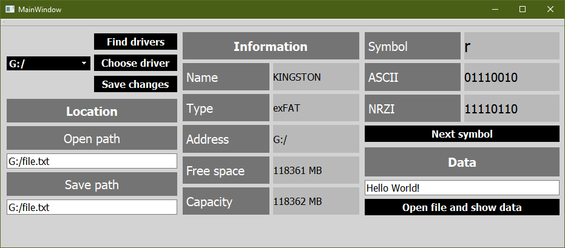

<h1>USB interface simulator</h1>
<h2>What is it?</h2>

This is a simple program created using the C++ programming language and the Qt graphics library. 
It simulates the operation of the USB interface, namely the codes of the message characters in the NRZI.

<h2>How does it work?</h2>

First, you need to click the "Find drives" button and open the drop-down list to select the USB drive you need, if any. 
Then click the "Choose drive" button, and you will see information about the drive in the middle of the window.
Use the button in the lower right corner to open the file and view its contents. 
Click the "Next symbol" button to move to each next character to see its ASCII and NRZI codes.  
At the end, click the "Save changes" button to save the changes and clear the window.

<h2>What does it look like?</h2>

<h2>Additional sources</h2>

    <ul>
        <li><a href="https://en.wikipedia.org/wiki/Non-return-to-zero#Non-return-to-zero_inverted">NRZI</a>;</li>
        <li><a href="https://en.wikipedia.org/wiki/USB">USB</a>.</li>
    </ul> 

